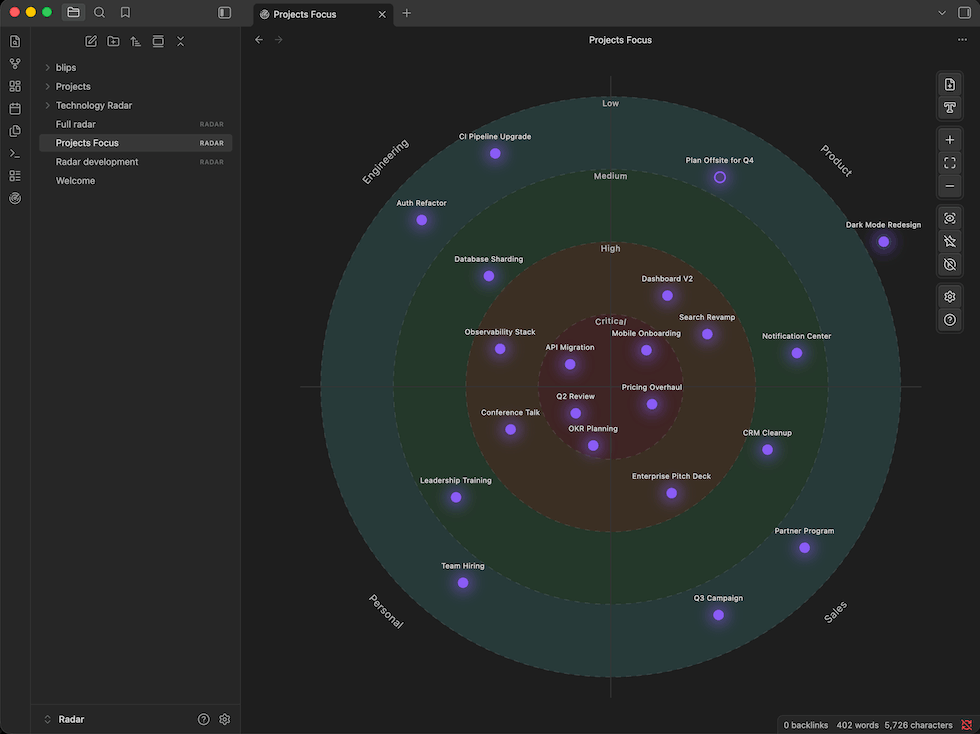
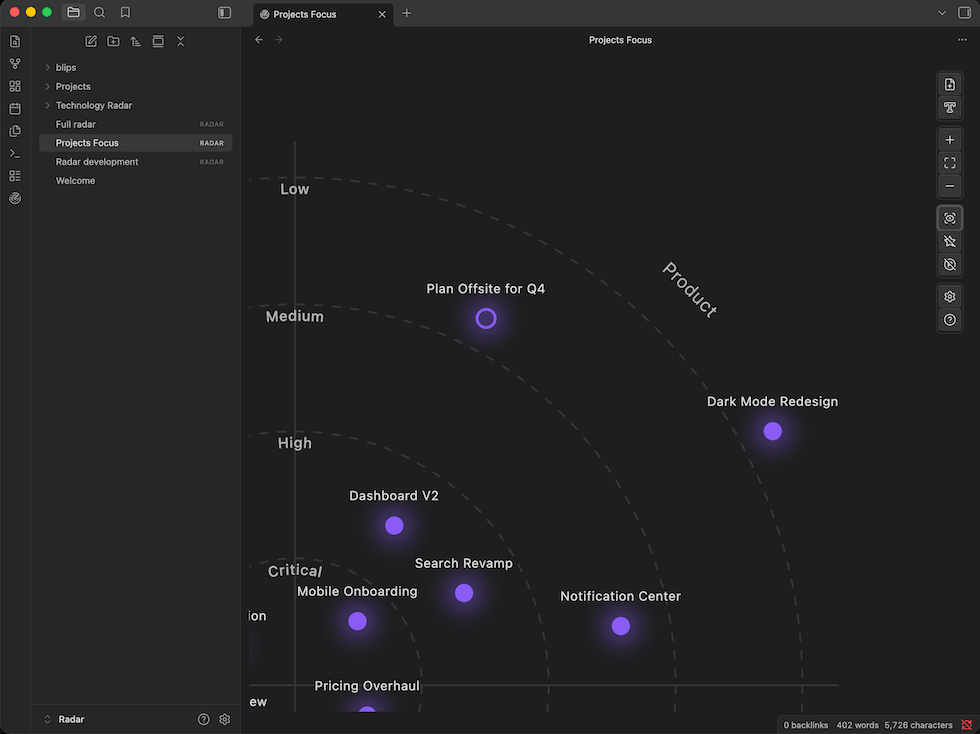

# Obsidian Radar

*This plugin helps to answer the question: "What's on your radar?"*

Visualize your notes and ideas on a radar. Group them by topic, prioritize by proximity to the center, and keep focus when juggling multiple areas at once. Do not lose sight of items that might be hiding good opportunities.



## Example usage

- **Prioritize your initiatives** — quickly glance at what's important to focus on right now. Place active work near the center and keep an eye on what's on the horizon without losing track of it.
- **Technology Radar** — communicate to your engineering team what technologies to adopt, trial, hold, or avoid, organized by category (languages, tools, platforms, techniques).
- **Personal knowledge management** — track topics you're actively researching, want to explore, or are letting go. Keep your curiosity organized without forcing every idea into a rigid hierarchy.
- **Project portfolio** — maintain a bird's-eye view of all your projects. Spot which ones are drifting to the periphery before they stall out completely.

Still not sure? Use the [skill](skills/obsidian-radar/SKILL.md) and ask your assistant in your vault to come up with an something. Here's a sample prompt:

> Create a Radar file to prioritize my projects, available in the `@Projects/` folder. The categories I want are Engineering, Marketing, Backoffice and Product. For each note and based on their content, create a blip, put them on the right quadrant and suggest a priority level. Create the file as `Project Focus.radar`.



## Features

- **Radar visualization** — items (blips) are placed on a radar divided into concentric priority rings and category segments; drag, pan and zoom freely
- **Two blip types** — link a blip to a vault note, or create a standalone text blip
- **Priority levels** — 1–8 configurable levels; the closer to the center, the higher the priority
- **Category segments** — 3–8 configurable segments to group blips by topic or area
- **Convert text blip to note** — promote any text blip to a linked vault note in one click
- **Easy to use** — drag notes from the file explorer directly onto the radar, access notes easily
- **Customizable** — set colors per priority level, per category, and per blip; adjust blip size and label font size. Add new categories and priority levels without changing blip prioritization. Support multiple visualization modes.
- **Command palette** — all major actions are available as commands so you can setup global keyboard shortcuts
- **Mobile app supported**
- **Support for AI Workflows**: use the [obsidian-radar skill](skills/obsidian-radar/SKILL.md) to create and maintain radars from your Obsidian AI-enabled vault.

## JSON Radar Spec

`.radar` files are stored as UTF-8 JSON in your vault. The format is self-contained — rings, segments, blips, and display settings are all in a single file. This makes radars portable, version-controllable, and easy to generate or modify programmatically (e.g. from an AI workflow or a script).

See [docs/JSON-radar.md](docs/JSON-radar.md) for the full spec.

## Installing

### Skill: obsidian-radar

We'll provide an easier way to install, at the moment, you can copy the skill content available in the [skill](skills/) folder and use your AI platform guide to install it.

### Plugin: From the Obsidian community plugins browser

1. Open **Settings → Community plugins** and disable Safe mode if prompted
2. Click **Browse** and search for *Obsidian Radar*
3. Click **Install**, then **Enable**

### Plugin: Manual installation

1. Download `main.js`, `manifest.json`, and `styles.css` from the latest release
2. Create a folder at `<your vault>/.obsidian/plugins/obsidian-radar/`
3. Copy the three files into that folder
4. Open **Settings → Community plugins**, find *Obsidian Radar* in the list, and enable it

## Contributing

Contributions are welcome. Here is how to get started:

**Prerequisites:** Node.js 18+ and npm

```bash
# 1. Fork this repository, then clone your fork
git clone https://github.com/<your-username>/obsidian-radar.git
cd obsidian-radar

# 2. Install dependencies
npm install

# 3. Start the development build in watch mode
npm run dev
```

To test the plugin live, symlink (or copy) the repo folder into your test vault:

```
<your vault>/.obsidian/plugins/obsidian-radar -> /path/to/obsidian-radar
```

Then enable the plugin in **Settings → Community plugins**. After each change, run **Reload app without saving** in Obsidian (or use the [Hot Reload](https://github.com/pjeby/hot-reload) community plugin).

**Other useful commands:**

```bash
npm run build   # production build
npm run lint    # run ESLint on src/
```

Please open an issue before starting work on a large change so we can discuss the approach first.

--- 
Thanks for using it, if you like it, you can send your support!

[](https://buymeacoffee.com/lfcipriani)

[](https://github.com/sponsors/lfcipriani)
